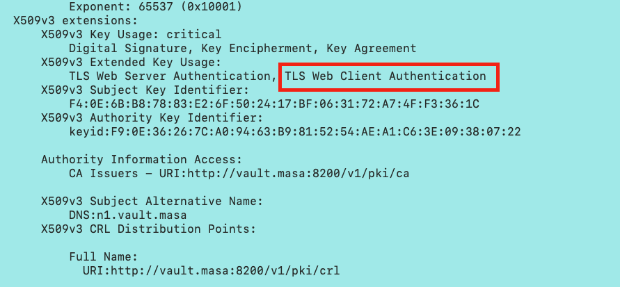

# Vault TLS authentication

このセクションではVaultのTLS認証について扱っていきます。TLSはTransport layer securityの略で、主にインターネット上の通信の暗号化に使用されます。サーバーもしくはクライアント間の通信を暗号化する際に、その相手が信頼できるEntityなのかを検証する仕組みがあります。その仕組を利用してVaultの認証としても機能させます。


## 事前準備

Self-signed CA (プライベート認証局)が必要となります。プライベート認証局の構築については、この章では触れませんが、Vault自体にPKIのルートCAや中間CAになる機能があります。もしVaultをルートCAとして設定する場合は[こちらのWorkshop](./pki.md)を参照ください。

Vault以外でも[OpenSSL](https://www.openssl.org/)などでも構築することができます。


### ClientのTLS証明書を発行

まず、Vaultで認証をする対象のホストへRootCAにより署名済みの証明書を発行します。証明書は`.pem`フォーマットで出力もしくは変換してください。

Vaultを認証局としている場合は、以下のようにコマンドもしくはAPIで発行できます。

Vaultコマンド：

```shell
vault write pki/issue/webapp common_name="web.masa.vault" ttl="24h"
```

Vault API：

```shell
curl -X PUT -H "X-Vault-Request: true" -H "X-Vault-Token: ${VAULT_TOKEN}" -d '{ "common_name":"n1.vault.masa", "ttl":"24000h" }' ${VAULT_ADDR}/v1/pki/issue/webapp
```

もし、Vault以外のツールで証明書を発行する場合は、証明書にCN（Common name）とTLS Web Client AuthenticationがExtented Key Usageにセットされているくことを確認ください。証明書の中身を表示するにはOpenSSLの以下のコマンドを使えます。

```shell
openssl x509 -in n1_cert.pem -noout -text
```

```
<kbd>
  
</kbd>
```

証明書が準備できたら、プライベートキーと一緒に対象のホストへ配布してください。ここでは割愛しますが、HashiCorpのConsulをVaultと組み合わせることで、Vaultが動的に発行した証明書をConsulが自動的に対象となるノードへ配付する、という事が可能になります。


## VaultのTLS auth methodの設定

まず、認証されたクライアントへ紐付けるPolicyを作成します。

```shell
cat << EOF > app_policy.hcl
path "secret/app/*" {
	capabilities = [ "list", "read", "create",  "update", "delete" ]
}
EOF

vault policy write apps app_policy.hcl
```

ここでは、Vault上の`secret/app/*`へ対するCRUDを許可するPolicyを作成しました。

次に、ルートCAもしくは中間CAの証明書を準備してください。認証局を構築したさいに作られているはずです。ちなみにVaultの場合、以下のAPIで取得することができます。

```shell
curl --header "X-Vault-Token: ${VAULT_TOKEN}" --request GET ${VAULT_ADDR}/v1/pki/ca/pem

```

では、Vaultのauth methodを有効化します。

```shell
vault write auth/cert/certs/app display_name=web policies=apps certificate=@rootCA.pem ttl=3600 
```

このコマンドにより`app`というロールに対して`web`という表示名で`apps`ポリシーがひも付きました。また、この認証により発行されるトークンのTTL（Time to live）は3600秒=1時間に設定しています。`certificate`の引数にルートCAもしくは中間CAのパブリック証明書（ここでは`rootCA.pem`）を指定します。これにより、このCAにより署名されたクライアント証明書に対して認証を行なうことができます。

TLS authでは他にも様々な設定を加えることができます。証明書に含まれる情報に対してマッチングを行い、怪しい証明書での認証を防ぐことができます。

|                          Parameter                           |                       説明                       |
| :----------------------------------------------------------: | :----------------------------------------------: |
| [`allowed_common_names`](https://www.vaultproject.io/api/auth/cert#allowed_common_names) |        CN (Common Name)でマッチングさせる        |
| [`allowed_dns_sans`](https://www.vaultproject.io/api/auth/cert#allowed_dns_sans) |              DNSでマッチングさせる               |
| [`allowed_email_sans`](https://www.vaultproject.io/api/auth/cert#allowed_email_sans) |             Emailでマッチングさせる              |
| [`allowed_uri_sans`](https://www.vaultproject.io/api/auth/cert#allowed_uri_sans) |              URIでマッチングさせる               |
| [`allowed_organizational_units`](https://www.vaultproject.io/api/auth/cert#allowed_organizational_units) | OU（Organizaitontional Unitt）でマッチングさせる |


それでは事前に準備されたクライアント証明書を用いてVaultの認証を行います。

| ファイル    |                           説明                            |
| ----------- | :-------------------------------------------------------: |
| n1_cert.pem | PEMフォーマットで保存されたクライアントのパブリック証明書 |
| n1_key.pem  |  PEMフォーマットで保存されたクライアントプライベートキー  |


### Vaultコマンドでの認証（ログイン）

```shell
vault login -method=cert -client-cert=n1_cert.pem -client-key=n1_key.pem name=app 
```

成功すると以下のように`apps`ポリシーが適用され、TTLが1時間のトークンが返ってきます。

```shell
$ vault login -method=cert -client-cert=n1_cert.pem -client-key=n1_key.pem name=app 
Success! You are now authenticated. The token information displayed below
is already stored in the token helper. You do NOT need to run "vault login"
again. Future Vault requests will automatically use this token.

Key                            Value
---                            -----
token                          s.tkFLR0q6izTRci7hOdHiMlSZ
token_accessor                 oAaqaehvHfTltVNdPrQwOx5q
token_duration                 1h
token_renewable                true
token_policies                 ["apps" "default"]
identity_policies              []
policies                       ["apps" "default"]
token_meta_authority_key_id    f9:0e:36:26:7c:a0:94:63:b9:81:52:54:ae:a1:c6:3e:09:38:07:22
token_meta_cert_name           app
token_meta_common_name         n1.vault.masa
token_meta_serial_number       12592408416000649981223452106881132322949090498
token_meta_subject_key_id      5f:09:6e:c7:e7:63:e4:67:7e:d8:3c:ce:a2:43:2c:69:79:a8:b5:b2
$ 
```


### APIでの認証（ログイン）

APIでの認証は以下のエンドポイントを叩きます。Vaultコマンドと同様の引数を渡しています。

```shell
curl -H "X-Vault-Request: true" -H "X-Vault-Token: ${VAULT_TOKEN}" --request POST --cert n1_cert.pem --key n1_key.pem -d '{"name":"app"}' ${VAULT_ADDR}/v1/auth/cert/login
```

成功すると以下のようにJSONフォーマットのレスポンスが返ります。

```shell
$ curl -s -H "X-Vault-Request: true" -H "X-Vault-Token: ${VAULT_TOKEN}" --request POST --cert n1_cert.pem --key n1_key.pem -d '{"name":"app"}' ${VAULT_ADDR}/v1/auth/cert/login
{
  "request_id": "90d6582e-adb7-e0d4-ddb4-4eceb609c2b4",
  "lease_id": "",
  "renewable": false,
  "lease_duration": 0,
  "data": null,
  "wrap_info": null,
  "warnings": null,
  "auth": {
    "client_token": "s.CMrmvU2s9Cat8L5hZYN2gDIl",
    "accessor": "fO3yUU9O710eCzBrkTKbn2nC",
    "policies": [
      "apps",
      "default"
    ],
    "token_policies": [
      "apps",
      "default"
    ],
    "metadata": {
      "authority_key_id": "f9:0e:36:26:7c:a0:94:63:b9:81:52:54:ae:a1:c6:3e:09:38:07:22",
      "cert_name": "app",
      "common_name": "n1.vault.masa",
      "serial_number": "95360875780328714077591222264518887760041986946",
      "subject_key_id": "f4:0e:6b:b8:78:83:e2:6f:50:24:17:bf:06:31:72:a7:4f:f3:36:1c"
    },
    "lease_duration": 3600,
    "renewable": true,
    "entity_id": "810c3c3c-942f-7051-9397-2b7b945f03d0",
    "token_type": "service",
    "orphan": true
  }
}
$
```


APIの認証はVaultバイナリがなくても利用できるので様々な場面で使えます。

- VaultがサポートしていないOS
- CI/CDツール
- コンテナ
- サーバーレス
- など


## まとめ

TLS認証はクライアント証明書（有効なもの）があればすぐに認証基盤として使えます。マイクロサービス化していく中で、サービス間通信も暗号化が重要となります。そうなると各々のサービスが証明書をすでに持っているケースもあります。そういった局面で、安全にシークレットへアクセスさせたいときに今回のTLS認証は有用ではないでしょうか？


